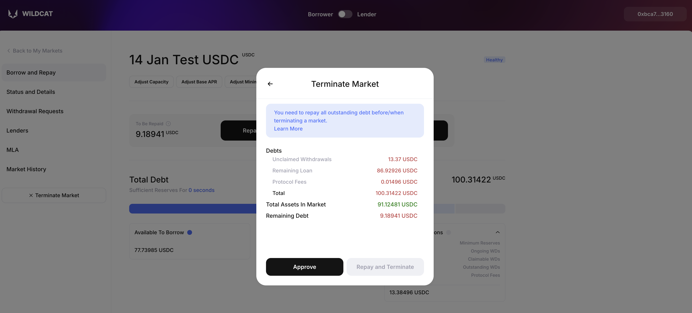

# Borrowers

## Launching A New Market

For the purpose of this section, we assume that the borrower has already gotten in contact with Wildcat and been added as a whitelisted borrower on the [**archcontroller**](../terminology.md#archcontroller) (the registry that tracks permissions and deployments).

Once this is done, the borrower can go to the protocol UI, and having signed the [**Service Agreement**](../terminology.md#service-agreement) (if not done already), navigate to the Borrower section.

Thereafter, you need to ensure that your Borrower Profile page is accurate: you can view this by clicking on View Profile after clicking on your signed in address in the top-right of the app:

<figure><figcaption></figcaption></figure>

Ensured this is filled out (folk at the Wildcat Foundation will make any changes here if needed): this is needed for grabbing information for the master loan agreement template if you opt to make use of it.&#x20;

Now click **Create New Market**.

<figure><figcaption></figcaption></figure>

There are a number of parameter fields that are presented here, and the screen may appear a bit overwhelming, but they fundamentally represent the degrees of freedom you have available to you. \
\
They are:

## 1) Policy Creation

This is the section that dictates what hook instance is used to govern the market.

### Market Policy

This dropdown allows for you to either re-use a policy that you have previously created, or instantiate a new one. Markets that are governed by the same policy all adhere to the same rules. If you select an existing policy here, the remaining three fields are auto-completed.

### Policy Name

Exactly what you'd expect: enter a unique identifier here that describes the policy.

### Market Type

Two options here:

* **Open Term**: deposits from lenders can be requested for withdrawal at will, at any time.
* **Fixed Term**: deposits can only be requested after a set amount of time has elapsed after market creation, whereupon the market converts to an open-term. Once a market has converted, it cannot be entered into another fixed term. If you select this option, another three sub-options are shown:
  * **Fixed Term Maturity Date \[00:00 UTC]**: when do you want to permit withdrawal requests? Please note that the Base APR _cannot be reduced_ while a market is in fixed-term!
  * **Permit Early Termination**: do you want to reserve the right to repay all market debt and stop accruing interest even while the market is in a fixed-term?
  * **Permit Maturity Reduction**: do you want to reserve the right to bring the maturity (conversion to open term) date closer to the present?

### Access Control

At present, we support two options here:

* **Lender Self-Onboarding**: any lender can grant themselves a deposit credential provided they are not sanctioned by OFAC as detectable through the Chainalysis oracle for that chain.
* **Borrower Operated Allowlist**: lenders can only deposit into markets if their address has been explicitly added to the policy by yourself.

<figure><figcaption></figcaption></figure>

## 2) Basic Market Setup

Here you are asked for what it is you want to borrow and how you want to identify the debt token that is issued in exchange.

### **Underlying Asset**

This is the asset that you wish to borrow, such as LUSD or WETH: enter the token address if it's not something that comes up based on entering the symbol. **DO NOT create markets with rebasing assets such as stETH as the underlying: this breaks the underlying interest model. It's not a vulnerability, but rather you'll just end up causing yourself pain.**

### **Market Token Name**

The prefix string that the **market token** issued to represent debt will use. For example, if you are borrowing _WETH_ (Wrapped Ethe&#x72;_)_ and enter '_West Ham Capital_' here, the name of the market token will be _West Ham Capital Wrapped Ether_.

### **Market Token Symbol**

The prefix string that the market token issued to represent debt will use. For example, if you are borrowing _WETH_ and enter '_whc_' here, the symbol of the market token will be _whcWETH_.

<figure><figcaption></figcaption></figure>

## 3) Basic Market Terms

Here you configure the capacity, rates, reserve ratio and minimum deposits of your market.

### Maximum Borrowing Capacity

This represents the initial **capacity** of the market - the maximum amount of debt that you're willing to pay interest on at launch. Note that depending on what you set the reserve ratio as, this does _not_ correspond to the amount that you are able to borrow from the market when fully subscribed.

### Base APR

The amount of interest that you are willing to pay on deposits to _lenders_. This is the rate that will apply presuming that your market never stays delinquent for long enough for the penalty APR to activate. The APR compounds every time the market is interacted with in a non-static call (such as a deposit or withdrawal request), so it's hard to determine precisely what the APY would be for this rate.

Wildcat V2 markets allow for this value to range between **0 - 100%**. The zero is in homage to the American central banking system. \
\
Note: that this is not the true APR that you pay in the presence of a [protocol fee](../protocol-usage-fees.md), which will be added onto the base rate (e.g. selecting a base rate of 10% for a market that includes a 5% protocol fee produces a final rate for the borrower of 10% + (0.05 \* 10%) = 10.5%. However, this 0.5% does not accrue to the rebasing debt tokens, but rather to the required reserves of a market over time.

### Penalty APR

The amount of _additional_ APR that you agree to pay in the event that your market becomes [**delinquent**](../terminology.md#delinquency) (i.e. falls below required reserves) and the delinquency is not resolved within the amount of time specified by the [**grace period**](../terminology.md#grace-period) (defined by yourself later), as observed by the [**grace tracker**](../terminology.md#grace-tracker).

Wildcat V2 markets allow for this value to range between **0 - 100%**. We encourage borrowers to select a non-zero value to illustrate the seriousness with which they intend to monitor their obligations.\
\
This penalty rate is added on to the base rate only for as long as the value of the grace tracker is above that of the grace period. The presence of an active penalty rate does not factor in to the calculation of any protocol fees that are in place, as Wildcat profiting from delinquent markets would present all manner of perverse incentives.

### Reserve Ratio

The percentage of the market **supply** that must remain _within_ the market available for redemption. For example, a market with a capacity of 100,000 tokens, a supply of 20,000 tokens and a reserve ratio of 25% must have 5,000 tokens within the market ready for lenders to withdraw.\
\
Wildcat V2 markets allow for this ratio to range between **0 - 100%.** This enables fully uncollateralised markets: however, a borrower will still be expected to maintain a small amount within the market to handle protocol fee accrual.\
\
Failing to maintain this level will result in the market becoming **delinquent**.\
\
Note that the capacity and the reserve ratio together dictate the _maximum_ that you are able to borrow from a market. A higher reserve ratio leads to a greater amount that you are paying interest on, but provides more of a cushion for lenders to easily exit their position, presuming that you fix delinquencies in a timely manner (lest you incur the _penalty APR_, see above).

### Grace Period Duration

The amount of time that a market is permitted to be delinquent for before the penalty APR activates. This parameter is measured in hours, and comes with a corresponding variable called the grace tracker, which measures the amount of time for which the market has been delinquent.\
\
The grace period is a _rolling limit_: once delinquency has been cured within a market, the grace tracker will count back down to zero from whatever value it had reached, and any penalty APR that is currently in force will only cease to do so after the grace tracker value is once again below the grace period.

Wildcat V2 markets allow for this value to range between **0 - 2160 hours** (90 days).\
\
Note: this means that if a markets grace period is 3 days, and it takes 5 days to cure delinquency, this means that **4** days of penalty APR are paid. **This is important**: a borrower does not necessarily have `grace_period` amount of time to cure each distinct instance of delinquency!

### Withdrawal Cycle Duration

The maximum amount of time that a lender who has filed a withdrawal request must wait before they are permitted to claim their assets from the market. If a lender has initiated a new withdrawal cycle, any other lender is able to join in the same cycle.

Wildcat V2 markets allow for this value to range between **0 - 2160 hours (90 days)**.\
\
This parameter exists in order to fairly distribute assets across multiple lenders given the undercollateralised nature of Wildcat markets. In the event that a significant amount of the supply is recalled at once, a longer withdrawal cycle permits reserves to be handed out _pro rata_ depending on the reserves within the market. For more on how this looks from the lenders perspective, please see the [**Lenders**](lenders.md) page.

### **Minimum Deposit**

What is the minimum amount of the underlying asset that will be accepted by the market in a single deposit transaction by an approved lender? Default value is zero, this is completely optional.

<figure><figcaption></figcaption></figure>

## 4) Lender Restrictions

This section is related to hook management, and allows for you to determine who can deposit and withdraw from markets, as well as how transferable the debt tokens (dfdUSDC, in this example) are:

* **Restrict Withdrawals** - restricts the ability to withdraw funds to users who meet market access criteria. **We recommend that this be turned on**.
* **Restrict Transfers** - ensures that market tokens can only be transferred between participants who meet the specific access requirements set by the market’s policy.
* **Disable Transfers** - stops the movement of tokens representing deposits or loans within the market. Transfers to the market starting withdrawal requests are not disabled.

<figure><figcaption></figcaption></figure>

## 5) Loan Agreement

This is not directly relevant to the structure of the market which is deployed, but borrowers are presented with the option of whether or not to make use of a Wildcat-specific master loan agreement for the protection of any lenders.

If the Wildcat MLA Template is selected, the borrower is required to pre-sign a copy of the [Template MLA](../../legal/master-loan-agreement.md) with the relevant parameters sourced from this market configuration and the borrower's profile. This document is then offered to lenders which seek to deposit to a market after onboarding, binding them to the borrower via contract. It defines certain warranties and covenants, discusses the handling of sanctions, accounts for the mutability of certain parameters and is intended to offer the lender protection via the legal system, as they shoulder the bulk of the risk in a trusted relationship.

If 'Don't Use' is selected, then a signature is still requested, but this is to log the fact that the borrower explicitly declined to add an MLA to the market. At present, MLAs cannot be retroactively added on to markets that did not start with one. In future, we will support the ability for borrowers to provide their own agreements, but for now, this is where we are.

Note that if you do not offer one, lenders may rightly ask why you felt it appropriate to refuse to do so. If your reasoning is because you would like a slightly different phrasing of terms or you need something more custom, please get in touch with us.

<figure><figcaption></figcaption></figure>

## Confirmation

At this point, you are presented with a summary of the market that you are about to create:

<figure><figcaption></figcaption></figure>

<figure><figcaption></figcaption></figure>

There are a series of notifications for you to pay attention to depending on your configuration, in particular regarding the protocol fee, which is derived from the Base APR as 5% of that value.

You are then asked to Sign: this is related to the MLA, and requires you to ECDSA sign the template agreement or your refusal to offer it.

<figure><figcaption></figcaption></figure>

After signing the MLA for your market (or your refusal to offer it), you can finally deploy!

## Sourcing Deposits

Once a given market is live, lenders can start onboarding to the market, depending on the access policy in place. For those markets which make use of an explicit address whitelist, the borrower must make use of the Market Details section of a market page to execute an on-chain transaction specifying one or multiple addresses.

Wildcat itself does not source capital providers for you, although we may well advertise the fact that your markets exist and what their parameters are (as well as any changes).

We defer the decision-making of who is 'allowed' to be onboarded to borrowers, but require that they do not seek to explicitly on-board lenders resident in sanctioned nations (even with things like geoblocking in place, an explicit whitelist can add whatever addresses they want).

If Wildcat notices that borrowers are breaching this incredibly light-handed requirement, we are likely to [offboard](borrowers.md#archcontroller-removal) the offending borrower, and may opt to remove affected markets from the UI. Crypto is global, and Wildcat isn't going to stand by and watch a borrower reap the whirlwind by authorising addresses clearly tied to North Korea.

## Borrowing From A Market

If we fast forward from here to the stage where lenders have onboarded and deposited assets, we can finally get to the _point_ of all of this: borrowing assets from the market that you have set up.

Remember that the _capacity_ you set for your market only dictates the maximum amount that you are able to source from lenders, and that your _reserve ratio_ will dictate the amount of the _supply_ that you cannot remove from a market.

If you have created a market with a maximum capacity of 1,000,000 USDC and a reserve ratio of 20%, this means you can borrow _up to_ 800,000 USDC provided that the market is 'full' (i.e. _supply_ is equal to _capacity_). In the event where the supply to this market is 600,000 USDC, you can only borrow up to 480,000 USDC.

The process of actually borrowing available assets from a market is simple: navigate to the market details page of your market, and you will be presented with the ability to withdraw assets up to the current reserve ratio. If you've used protocols such as Euler or Aave in the past, you'll be familiar with this.

We strongly advise not borrowing right up to the limit, as the result of this will be that your market becomes delinquent after the very next non-static call which updates the market state and rebases the market token supply.

Please also note that in the case where a protocol fee is in place for a market, said fees will accrue as [required reserves](../terminology.md#required-reserves) in the market over time, alongside interest that accrues to the rebasing debt tokens.

## Repaying A Market

The primary mechanic by which funds are recalled by lenders is through **withdrawal requests**, which isolate assets currently in reserve in a market for lenders to claim at the end of a withdrawal cycle (for more details on this, please refer to the [**Lenders**](lenders.md) page).

Withdrawal requests impact the liquid and required reserves of your market, and as such borrowers are minded to monitor their reserve ratios to determine when funds are being requested. Requests (including who has placed the request and for how much) are also logged within the Market History tab of a market from the borrower perspective.

The act of repaying is simple in the sense that it just requires moving assets back to the market contract via a standard ERC-20 transfer. Further, _anyone_ can repay assets to the market in this way - we've permitted this in case the borrower address is compromised.

In the event of such an address compromise, all lenders can file withdrawal requests, assets can subsequently be repaid from a third party, and - due to the manner in which withdrawal requests sequester assets during a withdrawal - can be honoured through the market contract without the compromised borrower address being able to access any assets.

## Reducing APR

The interest rate on a market is fixed at any given point in time (i.e. markets do not make use of a utilisation-rate based curve), however the borrower is free to adjust this rate step-wise should they wish, under the following formula:

* Should a borrower wish to increase the APR of a market in order to encourage additional deposits, they are able to do so without constraint.
* Should they wish to decrease the APR, they are able to do so by up to 25% of the current APR in a given two week period: a decrease of more than this requires that twice the amount is returned to the market reserves for that two week period to permit lenders to opt out ('ragequit') if they choose.\
  \
  To illustrate:
  * A borrower can reduce a market APR from 10% to 7.5% with no penalty, and two weeks thereafter will be able to reduce it again to 5.625%, and so on.
  * However, should a borrower reduce a market APR from 10% to 7.4% (a 26% reduction), they will be required to return 52% of the outstanding supply to the market for two weeks. After that time has passed, the reserve ratio can be reset back to the prior level and the assets can be borrowed again.

Note that the above only applies if your market is in an 'open-term' setting: i.e. there is no hook enabled which is preventing withdrawals at the time of the proposed change. If this is the case, you will not be able to reduce the APR while that hook is active (otherwise that enables a fairly obvious rug mechanic).

If you're confused by this, ask us directly!

## Altering Capacity

As a borrower, you are able to adjust the capacity up or down to whatever amount you wish. Note that that the rebasing of market tokens can bring the total debt of a market above such a capacity. Setting the capacity to below the current debt prevents further deposits until such time as the total supply has been reduced via withdrawal requests. Interest accrues on the outstanding supply until such time as lenders reduce the supply through withdrawal requests that burn market tokens. The required reserves of a market remain unchanged regardless of capacity changes.

## Altering Minimum Deposit

You are capable of adjusting the minimum deposit level of your market at any time (it defaulted to 0 if you didn't set it on market creation). Furthermore, you can stop any future deposits without reducing the market capacity by simply setting the minimum deposit above the capacity.

## Reducing Maturity

If your market is currently in a Fixed Term state, and you selected the Permit Maturity Reduction flag on market creation, you are able to bring the maturity forward (closer to the present day) at will. Note that you can't move the maturity further into the future, as that would enable a fairly obvious rug mechanism where you just set it to some impossible distance.

## Terminating A Market

In the event that a borrower has finished utilising the funds for the purpose that the market was set up to facilitate, the borrower can _terminate_ (close) a market at will.

This is a special case of reducing the APR (with the associated increased reserve rate that accompanies it). When a market is closed, sufficient assets must be repaid to increase the reserve ratio to 100%, after which interest ceases to accrue and _no further parameter adjustment or borrowing is possible_. The only thing possible to do in a closed market is for the lenders to file withdrawal requests and exit via claiming.

You can access this by clicking **Terminate Market** in the left-hand status bar as a borrower:

<figure><figcaption></figcaption></figure>

<figure><figcaption></figcaption></figure>

Note that the withdrawal cycle period is erased in terminated markets: lenders still have to file two distinct transactions (i.e. across separate blocks), but the withdrawal cycle period is not enforced in this instance. If a withdrawal cycle was ongoing when the market was terminated, it is immediately concluded, allowing lenders therein to claim.

## Archcontroller Removal

For whatever reason, it may be the case that the Wildcat protocol itself no longer wishes to permit a given borrower to engage further with it. In this case, the address(es) of a borrower can be removed from the archcontroller by its owners. If this happens, the borrower can no longer deploy _new_ hooks instances or markets.

However, they are still capable of interacting with _existing_ markets as before - neither the protocol nor its operators can force these closed. This is because there are potentially master loan agreements surrounding market usage, and Wildcat having the power to unilaterally step in and sever them would make it a key participant in the arrangement.
